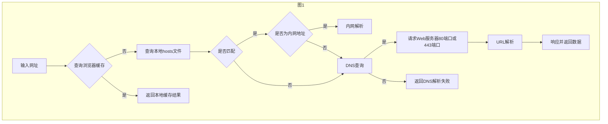

### 第一章 Web编程基础
---
1.Web工作原理
* 在浏览器中输入一个网址后发生了什么？


观察上图其实在浏览器输入一个网址后，简单的说会触发以下关键流程：

1.查询本地浏览器缓存，如果查询成功则返回本地缓存结果给用户。
2.查询本地缓存失败，会访问本地hosts文件，并检查是否有指定的匹配项。
3.如果本地hosts有匹配，发起系统调用。
4.如果匹配项是内网地址则进行内网解析。
5.如果匹配项不是内网地址则发起DNS查询。
6.查询失败那么返回DNS解析失败。
7.查询成功则拿到服务器ip和端口号请求服务器对应ip和端口绑定的应用程序。（web服务一般默认80端口或443端口）
8.进行URL解析。
9.返回结果给用户。

我们常说的网址是指一个URL
URL(Uniform Resource Locator)是`统一资源定位符`的英文缩写,用于描述一个网络上的资源, 基本格式如下:
```
scheme://host[:port#]/path/.../[?query-string][#anchor]
scheme         指定使用的协议(例如：http, https, ftp)
host           HTTP服务器的IP地址或者域名
port#          HTTP服务器的默认端口是80，这种情况下端口号可以省略。如果使用了别的端口，必须指明，例如 http://www.bilibili.com:8080/
path           访问资源的路径
query-string   发送给http服务器的数据
anchor         锚点（hash哈希）
```

`HTTP`（Hyper Text Transfer Protocol）也叫`超文本传输协议`。HTTP是一种让Web服务器与浏览器(客户端)通过Internet发送与接收数据的协议,它建立在TCP协议之上，一般采用TCP的80端口。

`HTTPS`（Hyper Text Transfer Protocol over SecureSocket Layer）也叫`超文本传输安全协议`。，一般采用TCP的443端口。

Http协议由以下3部分组成：
1.请求行
2.请求头
3.请求体

```http
#请求行
GET https://www.bilibili.com/ HTTP/1.1
#请求头
cache-control: no-cache
content-encoding: gzip
Connection: keep-alive
content-type: text/html; charset=utf-8
date: Mon, 01 Nov 2021 09:20:16 GMT
expires: Mon, 01 Nov 2021 09:20:15 GMT
user-agent: Mozilla/5.0 (Windows NT 10.0; Win64; x64) AppleWebKit/537.36 (KHTML, like Gecko) Chrome/93.0.4577.82 Safari/537.36
// 空行
// 请求体
```

比较重要的状态码
* 1XX 提示信息 - 表示收到请求，需要继续执行操作
* 2XX 成功 - 表示请求被成功接收并处理
* 3XX 重定向 - 要完成请求必须进行更进一步的处理
* 4XX 客户端错误 - 请求有语法错误或请求无法实现
* 5XX 服务器端错误 - 在处理请求的过程中发生了错误

其他相关：
1.HTTP协议常见版本，1.0（早期，很少使用）1.1（普遍），2.0（普及中）, 3（未来）
2.HTTP 1.1协议增加 keep-alive 减少TCP3次握手，实现资源复用。