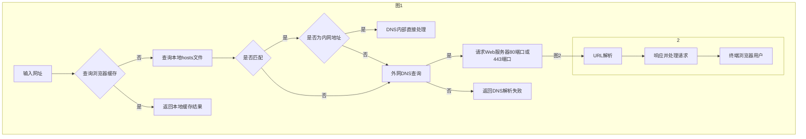
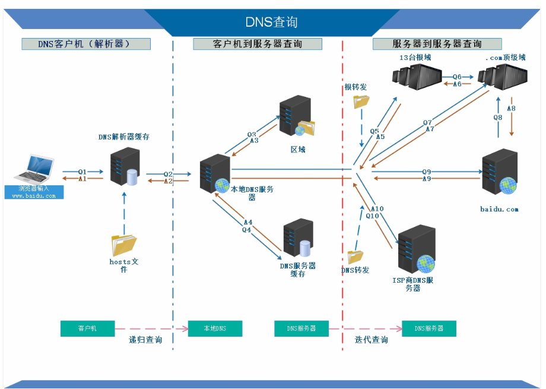
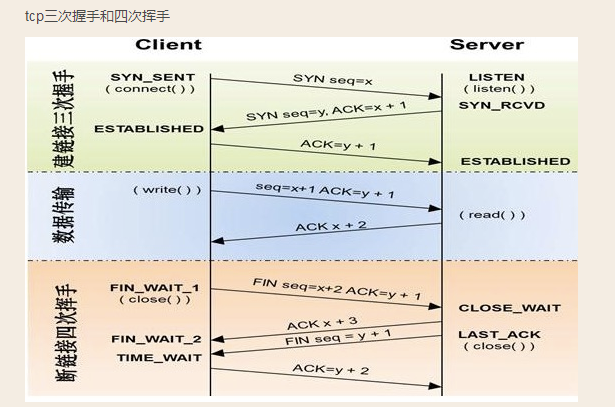
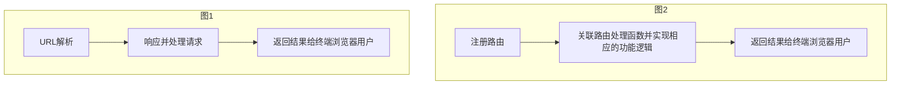

### 第一章 Web编程基础
---
#### 1. Web工作原理

我们常说的Web服务一般指B/S架构，B（Browser）指的就是我们的浏览器充当客户端，S（Server）指我们的Web服务器，作为服务器提供相应的服务，比如网页托管，文件托管等等。

我们看下在浏览器中输入一个网址后发生了什么？


观察上图其实在浏览器输入一个网址后，简单的说会触发以下关键流程：

1.查询本地浏览器缓存，如果查询成功则返回本地缓存结果给用户。

2.查询本地缓存失败，会访问本地hosts文件，并检查是否有指定的匹配项。

```shell
# localhost name resolution is handled within DNS itself.
127.0.0.1       localhost
::1             localhost
```

3.如果本地hosts有匹配，发起系统调用。

4.如果匹配项是内网地址则DNS内部处理直接进行内网解析。

5.如果匹配项不是内网地址则发起正常的DNS查询。

6.查询失败那么返回DNS解析失败。

7.查询成功则拿到服务器ip和端口号请求服务器对应ip和端口绑定的应用程序。（web服务一般默认80端口或443端口）

8.进行URL解析。

9.处理请求并返回结果给用户。

##### DNS解析
 <div style="text-align:center;margin: 0 auto;">
    
</div>

##### URL(我们常说的网址)（URI 统一资源标识符 URL是URI的子集）

URL(Uniform Resource Locator)是 `统一资源定位符` 的英文缩写，用于描述一个网络上的资源，基本格式如下:

```
scheme://host[:port#]/path/.../[?query-string][#anchor]
scheme         指定使用的协议(例如：http, https, ftp)
host           服务器的IP地址或者域名
port#          HTTP服务器的默认端口是80，HTTPS服务器默认端口是443，这种情况下端口号可以省略。如果使用了别的端口，必须指明，例如 http://www.bilibili.com:8080/
path           访问资源的路径 '/'一般指服务器的根路径
query-string   发送给http服务器的数据
anchor         锚点（hash哈希）
```

`HTTP`（Hyper Text Transfer Protocol）也叫 `超文本传输协议`。HTTP是一种让Web服务器与浏览器(客户端)通过Internet发送与接收数据的协议，它建立在TCP协议之上，一般采用TCP的80端口。

`HTTPS`（Hyper Text Transfer Protocol over SecureSocket Layer）也叫 `超文本传输安全协议`，一般采用TCP的443端口。

##### HTTP协议由以下3部分组成：

1.请求行

2.请求头

3.请求体

##### HTTP 请求示例

```shell
#请求行
GET https://www.bilibili.com/ HTTP/1.1
#请求头
accept-encoding: gzip, deflate, br
accept-language: zh-CN,zh;q=0.9,en;q=0.8,zh-TW;q=0.7
user-agent: Mozilla/5.0 (Windows NT 10.0; Win64; x64) AppleWebKit/537.36 (KHTML, like Gecko) Chrome/93.0.4577.82 Safari/537.36
# 自定义请求头
x-request-id: 123456
// 空行
// 请求体
```

##### HTTP 响应示例

```shell
#响应行
HTTP/1.1 200 OK
#响应头
cache-control: no-cache
content-encoding: gzip
content-type: text/html; charset=utf-8
date: Mon, 01 Nov 2021 12:55:08 GMT
expires: Mon, 01 Nov 2021 12:55:07 GMT
#自定义响应头
x-cache-time: 0
x-cache-webcdn: MISS from blzone02
// 空行
// 返回内容 html...或其他
```

##### HTTP请求方法

 * `GET` 读取数据，一般语义表示读取数据。
 * `POST` 提交数据（例如提交表单或者上传文件），数据被包含在请求体中。一般语义表示增加数据
 * `PUT` 提交数据，一般语义表示修改数据。
 * `DELETE` 一般语义表示删除数据。
 * `OPTIONS` 一般用于检测服务器所支持的请求方法。
 * PATCH 提交数据，一般语义表示修改部分数据。
 * HEAD 读取数据但不返回请求体。
 * TRACE 主要用于测试或诊断。
 * CONNECT 一般用于创建代理。

##### 比较重要的状态码

* 1XX 提示信息 - 表示收到请求，需要继续执行操作。
* 2XX 成功 - 表示请求被成功接收并处理。
* 3XX 重定向 - 要完成请求必须进行更进一步的处理。
* 4XX 客户端错误 - 请求有语法错误或请求无法实现。
* 5XX 服务器端错误 - 在处理请求的过程中发生了错误。

##### 其他相关：

1. HTTP协议常见版本：
  * 1.0（早期，很少使用）
  * 1.1（普遍）
  * 2.0（普及中）
  * 3（未来）

2. HTTP协议是一种无状态、无连接的协议
 * 无状态（服务器中没有保存客户端的状态）
 * 无连接（每次处理一个请求。服务器处理完请求，并收到客户端的应答后，即断开连接）

 `但HTTP 1.1协议增加 `keep-alive` 请求头，可以有效实现连接复用。（免去每次创建连接、TCP3次握手的性能损失）`

##### 三次握手，4次挥手
 <div style="text-align:center;margin: 0 auto;">
    
</div>

---

#### 2. 路由和路由处理器

##### 什么是Web路由？

> 我们常说的Web路由，简单的说就是一种URL和函数的映射关系。




   左图是我们一个浏览器请求Web服务响应流程图，对应到我们右图就是我们开发人员需要做的3件事：
  
  > 绑定一个特定的URL
  关联一个特定的路由处理函数
  完成功能并返回结果


  ##### 路由一般分为以下2种：
 
  <b style="font-size:14px">静态路由</b>
   
   ```
   GET  /users   #获取用户列表
   POST /users   #创建一个新用户
   PUT  /users   #更新用户信息
   ...
   ```

   <b style="font-size:14px">动态路由</b>

   ```
   DELETE /users/:id   #比如id为1时表示删除ID为1的用户
   GET    /users/:id   #比如id为1时表示获取ID为1的用户信息
   ...

   ```

   以上这种语义化的路由方式，我们也称为是一种 `REST API` (Representational State Transfer)，也可以理解为我们常说的 `CRUD` （增删改查）

   > C(Create) 增
   R(Read)     查
   U(Update)   改
   D(Delete)   删
  
  ##### 路由处理器
  
  关联某个特定路由的函数或方法，一般实现具体某些功能和业务逻辑并组合数据呈现给用户，这类函数或方法我们就称为 `路由处理程序`。（对应我们HTTP中的请求处理 `Request` 和响应 `Response`）

  http.Request
  > .Host 获取主机名称和端口号
	.Header 获取请求头
	.Method 获取请求方法类型，如GET, POST
	.URL.RawQuery 获取query-string
	.URL.Fragment 获取anchor
	.Referer() 获取请求来源
	.UserAgent() 获取浏览器特征
  .ParseForm() 将表单或query-string解析成map结构
	.ParseMultipartForm() 一般用于处理文件上传
	.Form.Encode() 对表单进行Url编码，对空格和特殊字符进行编码
  .Form.Get(key) 使用键名获取参数值
	.FormValue(key) 使用键名获取参数值

  http.ResponseWrite
  > .WriteHeader(code) 设置响应头 HTTP 状态码
	.Write([]byte) 设置响应体

  http.StatusXXX定义了完整的HTTP状态码
  > http.StatusOk -> 200
  ...

  方式一:

  ```shell
  package main

  import "net/http"

  // 实现一个自定义http.Handler
  type MyHandle struct{}

  // 实现接口中定义的方法
func (h MyHandle) ServeHTTP(writer http.ResponseWriter, req *http.Request) {
}

  func main() {

    // 注册路由，这里'/'表示匹配web服务根路径，它是一个默认资源路径
    // 使用自定义类型方式
    http.Handle("/", &MyHandle{})
    // 使用匿名函数方式
    http.HandleFunc("/", func(w http.ResponseWriter, r *http.Request) {
    })
    // 启动服务并监听8080端口，这里:8080表示绑定所有可用接口，而不仅仅是具有给定主机地址的接口。
    http.ListenAndServe(":8080", nil)

    // 绑定本地网卡IP内网IP地址为192.167.1.2接口的8080端口（具有给定主机地址）
    // http.ListenAndServe("192.168.1.2:8080", nil)
  }
  ```

  `DefaultServeMux`

  ServeMux默认实现，需要注意的是DefaultServeMux是一个全局变量，容易被污染。
  ```shell
  http.ListenAndServe(":8080", nil)
  ```

  正确的使用方式：
  ```shell
  mu := http.NewServeMux()

  // mu.handelFunc(path, handler)
  //...
  // 监听任意地址的的8080端口，并绑定路由处理器
  http.ListenAndServe(":8080", mu)
  ```

  #### 3. 表单进阶

  * JSON处理
  示例代码：
  ```shell
  // 定义结构体并添加标签
  type User struct {
    Id int        `json:"id"`
    Name string   `json:"name"`
  }
  
  // 读取请求体内容
  bytes, err := ioutil.ReadAll(r.Body)
  if err != nil {
    // 处理异常
  }
  // 防止内存溢出
  defer r.Body.Close()
  // ...
  var t User
  err = json.Unmarshal(bytes, &t) // 注意第二个参数是一个指针
  if err != nil {
    // 处理异常
  }
  // 其他业务逻辑
  
  ```
  * 表单验证
  
  ```shell
  # 安装依赖
  go get -u github.com/go-playground/validator/v10
  ```

  ```shell
  // 定义结构体并添加标签和验证方式
  type User struct {
    Id int        `json:"id" validate:"gt=0"`
    Name string   `json:"name" validate:"required"`
    Password string   `json:"password" validate:"required"`
  }
  
  // 读取请求体内容
  bytes, err := ioutil.ReadAll(r.Body)
  if err != nil {
    // 处理异常
  }
  // 防止内存泄露
  defer r.Body.Close()
  // ...
  var user User
  err = json.Unmarshal(bytes, &user) // 注意第二个参数是一个指针
  if err != nil {
    // 处理异常
  }
  // 表单验证
  // 初始化一个validator
  validator := validator.New()
  err = validator.struct(t)
  if err != nil {
    // 验证失败处理逻辑
    // ...
  }
  // 验证通过，正常逻辑
  ```

  > API文档：https://pkg.go.dev/gopkg.in/go-playground/validator.v10
  
  
  * 文件上传
  ```shell
  const maxMemory = 10 << 20 // 10M
  // 解析multipart-data, 注意第二个参数为字节数
  err := r.ParseMultipartForm(maxMemory)
  // r.MultipartForm.File 返回是一个map[string]*FileHeader类型，内部实现的
  headers := r.MultipartForm.File
  for _, fh := range headers { // 遍历Map
			for _, file := range fh { // 遍历切片 []*FileHeader
        // 设置文件保存路径（这里使用绝对路径） './'代表应用程序根路径
				fileSavePath := filepath.Join("./", file.Filename)

        // 打开原文件作为输入
				src, err := file.Open()
				if err != nil {
					panic(err)
				}
				defer src.Close()

        // 创建一个空文件作为输出
				dst, err := os.Create(fileSavePath)
				if err != nil {
					panic(err)
				}
				defer dst.Close()

        // io.Copy使用字节拷贝方式将输入写入输出
				_, err = io.Copy(dst, src)
				if err != nil {
					panic(err)
				}
			}
		}
  ```